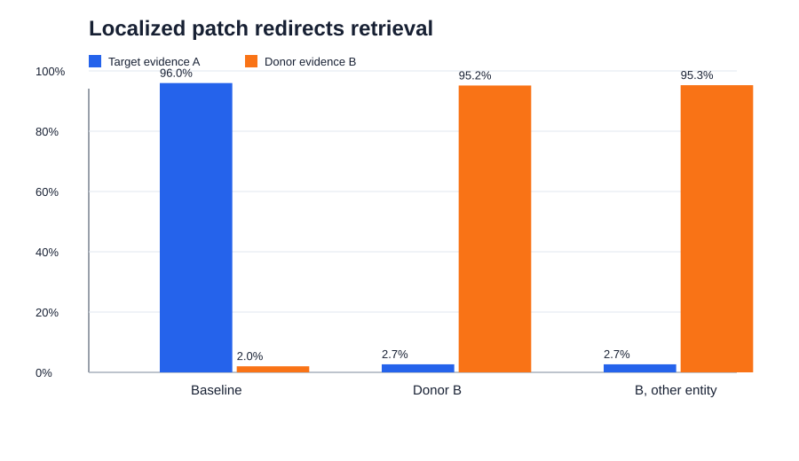
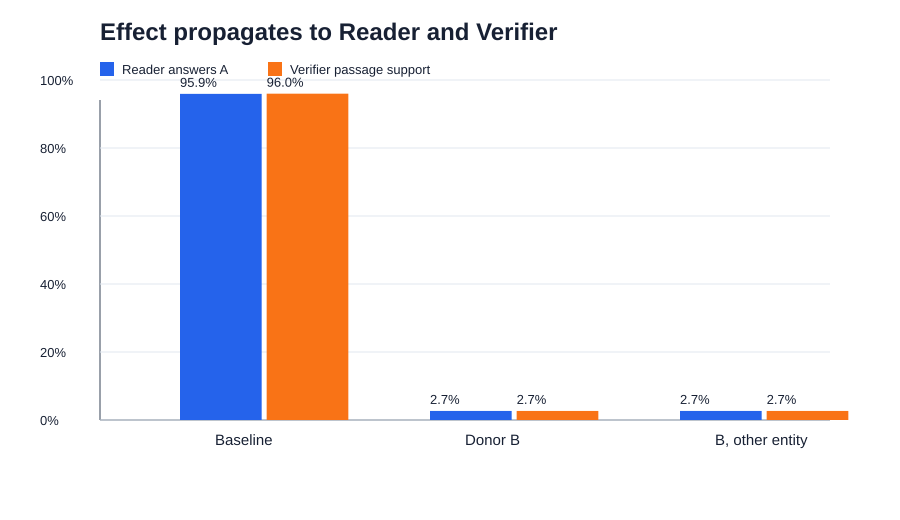

# End-to-end relation-transfer results

## Objective

The experiment tests whether relation information in a question
representation causally redirects evidence retrieval without erasing the
question, inserting zero vectors, changing the entity, or changing the
candidate documents.

## Design

The pipeline consists of a Retriever, Reader, and Verifier. For a target
question about relation A and a donor question about relation B, the
intervention replaces only the contextual hidden state of the relation-token
span in the Retriever. The entity, all other question tokens, document
embeddings, Reader, and Verifier remain unchanged.

Five conditions are compared: baseline, self patch, same-entity donor B,
same-entity control relation C, and donor B from a different entity. Relation
C controls for the general effect of inserting another natural relation
state. The different-entity donor tests whether the effect transfers across
entities.

Layer 1 was selected exclusively on 3,834 calibration examples and frozen
before the held-out test. The final test contains 3,678 directed examples from
613 entities.

## Main results

- Same-entity donor B minus relation-C control: **0.1906**, 95% CI
  **[0.1864, 0.1946]**, permutation p-value **0.00005**.
- Donor B from a different entity: **0.3627**, 95% CI
  **[0.3587, 0.3667]**, permutation p-value **0.00005**.
- All twelve directed relation pairs have positive B-minus-C contrasts and
  positive cross-entity donor effects.

## Downstream propagation

At baseline, target evidence A ranks first in 95.98% of examples, the Reader
returns the stored A answer in 95.92%, and corrected mean Verifier support is
0.9597.
After the same-entity B patch, donor evidence B ranks first in 95.16%, the
Reader retains the A answer in 2.66%, and mean Verifier support falls to
0.0266. The different-entity B condition shows the same qualitative pattern.

## Claim boundary

The intervention establishes a relation-specific causal influence on evidence
prioritization in this controlled benchmark and model configuration. It does
not establish a universal, fully disentangled relation code. Reader and
Verifier are not intervened on internally; their changes show functional
propagation of the altered retrieval context. The Verifier scores support
between the original question and the top-ranked passage, not correctness of
the Reader's extracted answer.

The Verifier values come from the 2026-09-23 corrected training run, which
excluded every passage from calibration and test entities. Its threshold-0.5
decisions are identical to the historical run. Because this correction reused
an already observed test split, it is post-hoc robustness evidence rather than
a second blind confirmation. Retrieval and Reader results are unchanged.
